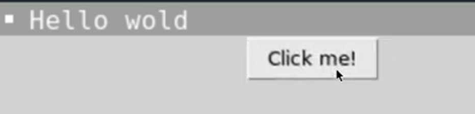

# Hide & Remove

**DISCLAIMER: I promise the good stuff is coming back. We have to go through the valley to get to the mountain, right?**

Sometimes, we want to remove a button, image or piece of text from the screen.

To do this, we use `pack_forget()`.

👉 We'll start with our default tkinter program.

```python
import tkinter as tk

window = tk.Tk()
window.title("Hello World") 
window.geometry("300x200") 


hello = tk.Label(text = "Hello World") 
hello.pack() 

button = tk.Button(text = "Click me!") 
button.pack()

tk.mainloop()
```

👉 Now I'm going to add a new subroutine to hide the label and call it on a button click.

```python
import tkinter as tk

window = tk.Tk()
window.title("Hello World") 
window.geometry("300x200") 

# New subroutine
def hideLabel():
  hello.pack_forget() # Removes the 'hello' label

hello = tk.Label(text = "Hello World") 
hello.pack() 

button = tk.Button(text = "Click me!", command = hideLabel) # Calls the 'hideLabel' sub on click.
button.pack()

tk.mainloop()
```

👉 Let's look at the window after this code runs:


Yay! The label has been hidden.

## Come Back!

To bring the label back, we use a Boolean variable to store the state of the label. Is it 'on' (True) or 'off' (False)?  The variable starts as True.

I'll add this variable to the `hideLabel` sub as a global, and set it to 'False' when the sub is called.

Now I can use **selection** in the `hideLabel` sub to check the value in `labelOn`. If it's 'True' I'll hide the label, if it's 'False', I'll show the label.

```python
import tkinter as tk

window = tk.Tk()
window.title("Hello World") 
window.geometry("300x200") 

labelOn = True

def hideLabel():
  global labelOn

  if labelOn: # if labelOn is Python shorthand for 'if labelOn == True'
    hello.pack_forget()
    labelOn = False
  else:
    hello.pack()
    labelOn = True

hello = tk.Label(text = "Hello World") 
hello.pack() 

button = tk.Button(text = "Click me!", command = hideLabel) 
button.pack()

tk.mainloop()
```
Try it out. The button should now toggle the label from visible to invisible. 

👉 It will spawn underneath the button though, so we'll need to control where it loads.

I can do this by hiding and respawning everything in the correct order in the `else` part of the selection.
```python
def hideLabel():
  global labelOn

  if labelOn: 
    hello.pack_forget()
    labelOn = False
  else:
    button.pack_forget #hides the button
    hello.pack() # shows the label first (top of the window)
    button.pack() # then reloads the button underneath
    labelOn = True
```

### Try it out!